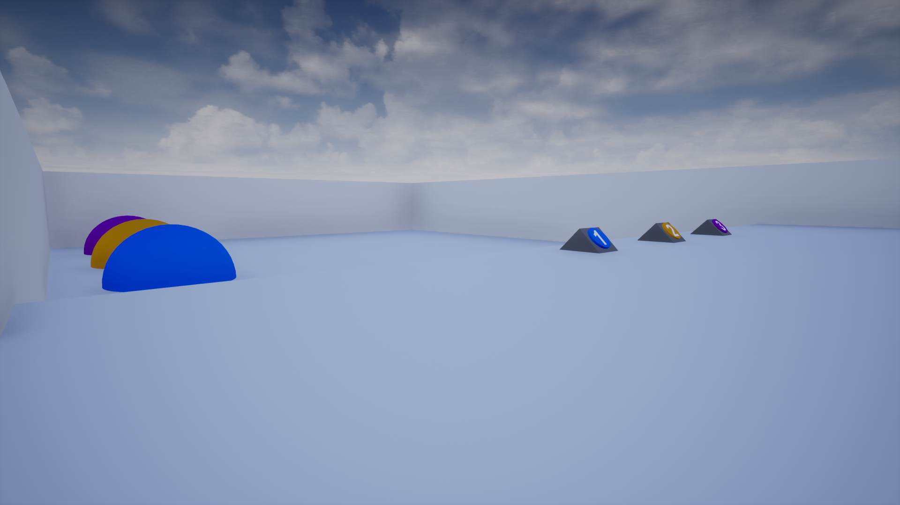

# RunningTurtles

🕹️ A demo project created in purpose to train character creation and it's interaction with environment in 3D space.  

:turtle: Tje projects consists of a level where three buttons are placed. Every button connected to a turtle spawner on a demonstration platform. When the button is pressed, a turtle appears from corresponding spawner. Turtles from every spawner move differently: \n
From the first spawner: moves towards destination point;
From the second spawner: moves towards destination point for a second, then stands still for a halfsecond, then moves again etc.
From the second spawner: moves towards destination point for a second, then moves back for a halfsecond, then moves forward again etc.

Here is a [link](https://drive.google.com/drive/folders/1ljHtDI2k8kMiC--J0k_ZAShPDJzvWB1P?usp=sharing) to last version of the game (need to download the folder and run .exe file). 

